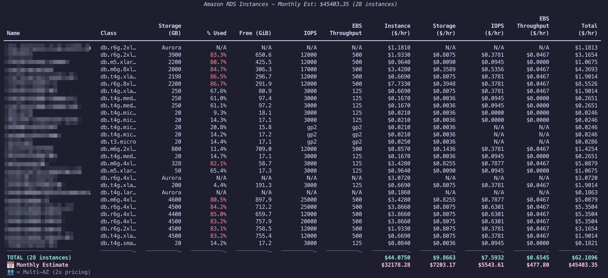
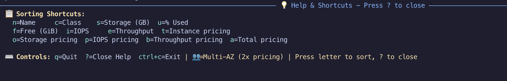

# 🚀 Smart RDS Viewer

> **Your terminal companion for monitoring Amazon RDS instances with real-time data, pricing, and interactive insights!**

A powerful, full-screen terminal CLI that fetches and displays all your Amazon RDS instances with live metrics, pricing, and interactive sorting - all from the comfort of your terminal.





## ✨ Features

### 🔍 **Real-time Data Fetching**

- **RDS Metadata**: Fetches all RDS instances using `boto3`
- **CloudWatch Metrics**: Live storage usage from CloudWatch APIs
- **Live Pricing**: On-demand hourly pricing from AWS Pricing API
- **Smart Caching**: 24-hour pricing cache in `/tmp` for faster subsequent runs

### 📊 **Rich Interactive Table**

- **Full-screen Terminal**: Professional full-screen interface like `eks-node-viewer`
- **Comprehensive Columns**: 12+ metrics including all pricing components
- **Smart Highlighting**: Targeted red highlighting for storage issues (≥80% usage)
- **Multi-AZ Support**: 👥 indicators with accurate 2x pricing for Multi-AZ instances
- **Aurora Compatible**: Special handling for Aurora instances and pricing
- **Real-time Updates**: Live data refresh with loading spinners

### 🎮 **Interactive Controls**

- **Dynamic Shortcuts**: Auto-assigned lowercase keys matching table column order
  - `n` = Name, `c` = Class, `s` = Storage, `u` = % Used
  - `f` = Free, `i` = IOPS, `e` = Throughput, `t`/`o`/`p`/`h`/`a` = Pricing columns
- **Smart Sorting**: Toggle ascending/descending with same key
- **Help System**: Press `?` for interactive help overlay
- **Clean Exit**: `q` or `Ctrl+C` to exit with terminal cleanup

### 📈 **Comprehensive Metrics**

- **Instance Details**: Name, class, Multi-AZ indicators (👥)
- **Storage Analytics**: Used percentage, free space in GiB
- **Performance**: IOPS, EBS throughput (with GP2/GP3 awareness)
- **Complete Cost Breakdown**: Instance, Storage, IOPS, and EBS Throughput pricing
- **Monthly Estimates**: Automatic monthly cost calculations with summary totals

## 🛠️ Installation

### Prerequisites

- Python 3.8+
- AWS credentials configured (environment variables or IAM profile)
- Required AWS permissions for RDS, CloudWatch, and Pricing APIs

### Quick Start

#### Option 1: Run as Python Script

```bash
# Clone and setup
git clone <your-repo>
cd smart-rds-viewer

# Create virtual environment
python3 -m venv venv
source venv/bin/activate  # On Windows: venv\Scripts\activate

# Install dependencies
pip install -r requirements.txt

# Run the viewer
python rds_viewer.py
```

#### Option 2: Build and Run as Binary

```bash
# Clone and setup
git clone https://github.com/k4kratik/smart-rds-viewer
cd smart-rds-viewer

# Install dependencies
pip install -r requirements.txt

# Build the binary
python build.py
# OR use make: make build

# Run the binary
./dist/smart-rds-viewer
# OR use make: make run-binary
```

### Build Commands

```bash
# Build binary
make build

# Clean build artifacts
make clean

# Install dependencies
make install

# Run Python version
make run

# Run binary version
make run-binary

# Show all commands
make help
```

## 🎯 Usage

### Basic Usage

```bash
# Standard run
python rds_viewer.py

# Force fresh pricing data (bypass cache)
python rds_viewer.py --nocache
```

### Interactive Controls

- **Sorting**: Press any column shortcut to sort
- **Help**: Press `?` to toggle help overlay
- **Quit**: Press `q` or `Ctrl+C` to exit

### Column Shortcuts (Auto-assigned, match table order)

| Key | Column                | Description                         |
| --- | --------------------- | ----------------------------------- |
| `n` | Name                  | Instance identifier (👥 = Multi-AZ) |
| `c` | Class                 | Instance type (db.r5.large, etc.)   |
| `s` | Storage (GB)          | Allocated storage                   |
| `u` | % Used                | Storage utilization percentage      |
| `f` | Free (GiB)            | Available storage space             |
| `i` | IOPS                  | Provisioned IOPS                    |
| `e` | EBS Throughput        | Storage throughput (MB/s)           |
| `t` | Instance ($/hr)       | Instance hourly pricing             |
| `o` | Storage ($/hr)        | Storage hourly pricing              |
| `p` | IOPS ($/hr)           | IOPS hourly pricing                 |
| `h` | EBS Throughput ($/hr) | Throughput hourly pricing           |
| `a` | Total ($/hr)          | Total hourly cost                   |

## 🔧 Technical Details

### Architecture

- **Modular Design**: Separate modules for fetching, metrics, pricing, and UI
- **Error Handling**: Graceful fallbacks for API failures
- **Caching**: Smart pricing cache with 24-hour expiration
- **Full-screen UI**: Rich-based terminal interface

### AWS APIs Used

- **RDS**: `describe_db_instances` for metadata
- **CloudWatch**: `get_metric_statistics` for storage metrics
- **Pricing**: `get_products` for live pricing data

### Cache System

- **Location**: `/tmp/rds_pricing_cache.json`
- **Duration**: 24 hours
- **Auto-refresh**: Expired cache triggers fresh API calls
- **Manual override**: Use `--nocache` flag to force fresh data
- **Error Recovery**: Corrupted cache falls back to API

## 🤖 Built with AI Assistance

This tool was collaboratively developed with the help of **Claude Sonnet 4**, an AI coding assistant. The development process involved:

- **Architecture Design**: Modular structure with separate modules for different concerns
- **Feature Implementation**: Real-time data fetching, caching, interactive UI
- **Problem Solving**: Debugging pricing API issues, fixing cache serialization
- **User Experience**: Full-screen terminal interface, dynamic shortcuts, help system
- **Documentation**: Comprehensive README with all features and future roadmap

The AI assistant helped transform a simple concept into a comprehensive, production-ready RDS monitoring tool with advanced features like smart caching, interactive sorting, and professional terminal UI.

## 🤝 Contributing

We welcome contributions! Please feel free to submit issues, feature requests, or pull requests.

## 📄 License

This project is licensed under the MIT License - see the LICENSE file for details.

## 🙏 Acknowledgments

- Built with [Rich](https://github.com/Textualize/rich) for beautiful terminal UI
- Powered by [boto3](https://github.com/boto/boto3) for AWS integration
- Inspired by modern CLI tools like `eks-node-viewer`
- **AI Development Partner**: Claude Sonnet 4 for collaborative coding and problem-solving

---

**Happy RDS monitoring! 🎉**

_Your terminal is now your RDS command center!_
